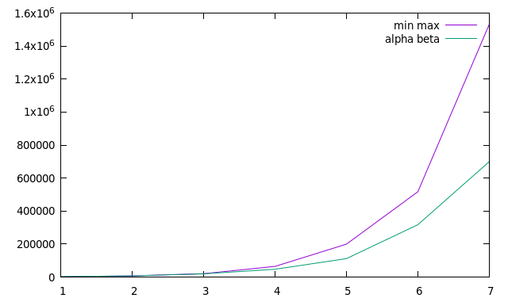
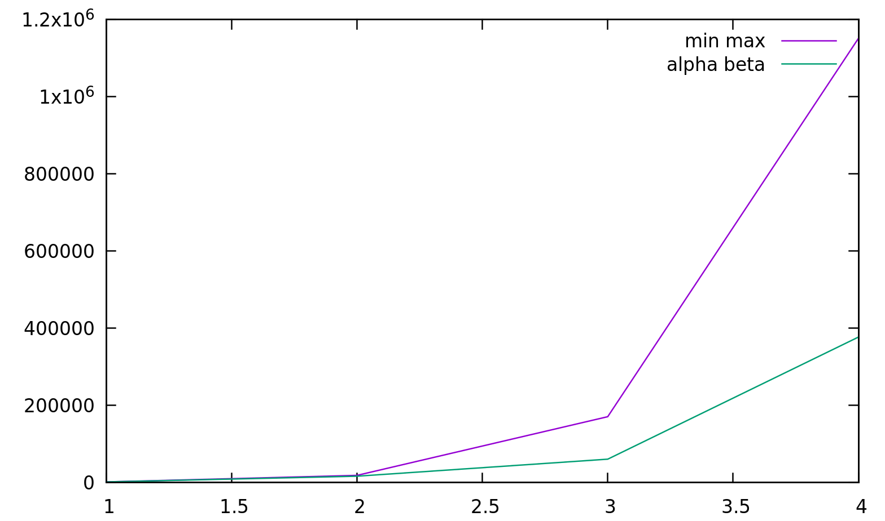

Mussard Wassim - 28706762

## Rapport Projet LU2IN013 

### Introduction 

L'objectif de l'UE LU2IN013  est de pouvoir implémenter deux jeux à 2 joueurs qui sont le `Othello` et `l'Awélé`. Pour cela , on part d'un fichier code commun aux 2 jeux : `game.py` .
### Awélé 
 Nous avons essayé  d'implémenter différents types de joueurs avec lesquels nous avons reporté certaines données pour réaliser des courbes  .

 * `alpha-beta` vs `min-max` : 
 
    

   Comme attendu , lorsqu'on regarde la  complextité (le nombre de noeuds visités) en fonction de la profondeur, le joueur `alpha-beta` est plus performant que le joueur `min-max`. 

* `alpha_beta_param` *(profondeur 1)* vs `alpha_beta` *(profondeur 6)*
   
    
   
   Ce graphe représente le nombre de victoires de notre joueur paramétrique en fonction du nombre de manches. Chaque manches représentent *100* parties et *1* partie a au plus *100* tours. Ici notre joueur a une liste paramétrique qui a toutes ses valeurs initialisées à *0*. A la fin des *1000* manches, on récupère la liste finale de notre joueur paramétrique et on recommence le test. 
  

   
      
   Ainsi, on remarque que notre joueur a battu son ancien record de victoire avec *26* victoires en *1000* manches.    
   
   
   On remarque que pour le même nombre de manches, on a un meilleur ratio de victoire . De plus, on fait plus de *25* victoires avec moins de *1000* manches alors que pour le premier test on ne  faisait même pas les  *25* victoires en *1000* manches .

* `alpha_beta_param` *(profondeur 1)* vs `alpha_beta` *(profondeur 6)* *(deuxième version)*  
   Dans cette deuxième version , nous avons décidé de  modifié la liste paramétrique de notre joueur . En effet, maintenant  en fonction de l'avancée de la partie, le joueur commencera avec la liste paramétrique `params_BEG` *(début de partie)* , `params_MID` *(milieu de partie)* et enfin `params_END` *(fin de partie)* .
   
   
   
   Pour ce test , nous avons décidé d'avoir un joueur qui a comme listes paramétriques initiales:  *params _BEG = [0,0,0,0,0,0,0,0,0]*, *params_MID = [0,0,0,0,0,0,0,0,0]*, *params_END =[0,0,0,0,0,0,0,0,0]*.
   Notre plus grand nombre de victoire est : *21* . Réessayons ce test avec  la liste paramétrique obtenue après les *1000* manches .

   

   On constate, que les *21* victoires sont atteintes plus rapidement que le premier test. Environ *200* parties  contre *100* parties ici. Après les *1000* manches, on atteint *25* victoires contre le joueur `alpha_beta` à profondeur *6*.

   * Notre joueur `paramétrique` a donc bien appris contre le joueur `alpha_beta` à profondeur 6. 

### Othello
 Comme pour l'Awélé, nous avons également réaliser des courbes pour nos différents joueurs de `l'Othello`.
 * `alpha-beta` vs `min-max` : 

   

   Ces courbes sont obtenues pour *1* manche de *10* parties. On compare le nombre de noeuds visités en fonction de la profondeur et on constate que le joueur `alpha-beta` est bien  plus efficace que le joueur `min-max`.

*  `alpha_beta_param` *(profondeur 1)* vs `alpha_beta` *(profondeur 4)* :

    vs alpha_beta (profondeur 4)")

   Ici, nous avons réalisé *20* manches de *100* parties entre notre joueur `paramétrique` et notre joueur `alpha_beta`. Comme pour l'Awélé, on commence par tester notre joueur avec une liste paramétrique qui a ses valeurs initialisées à *0*.

    vs alpha_beta (profondeur 4)")

   Ainsi, en prenant la dernière liste paramétrique, on remarque  que notre joueur a reussit à gagner *3* fois pour le même nombre de manches, il y a donc un début d'apprentissage.

* `alpha_beta_param` *(profondeur 1)* vs `alpha_beta` *(profondeur 4)* *(deuxième version)*  

   Essayons notre joueur paramétrique avec les listes paramétriques suivantes: *params_BEG = [0,0,0,0,0]*,  *params_MID =[0,0,0,0,0]* et *params_END =[0,0,0,0,0]*. 

    vs alpha_beta (profondeur 4)")
   
   On voit qu'on a notre première victoire au bout de la *6ème* manches.

    vs alpha_beta (profondeur 4)")

   Alors que maintenant avec la nouvelle liste paramétrique, on voit qu'on a notre première victoire au bout de la *2ème* manches.

* `alpha_beta_param` *(profondeur 1)* vs `alpha_beta` *(profondeur 2)* *(troisième version)*

   Afin d'avoir un taux d'apprentissage plus significatif, on a décidé de refaire une dernière fois le test entre un joueur paramétrique de profondeur *1* contre un joueur alpha_beta de pronfondeur *2*.

    vs alpha_beta (profondeur 2)")

   On obtient donc une courbe d'apprentissage qui nous montre que notre joueur paramétrique, (avec une liste paramétrique initialisée à *0* ), gagne de plus en plus contre le joueur alpha_beta de profondeur *2* et on constate qu'au bout des *100* manches, on atteint au maximum *38* victoires.

    vs alpha_beta (profondeur 2)")

   Enfin, on voit que pour le même nombre de manches on a atteint les *50* victoires. Notre joueur paramétrique a donc bien appris contre le joueur alpha_beta de profondeur *2*.

### Conclusion

   Enfin, nous avons donc implémenté nos $2$ jeux avec différents type de joueurs afin de découvrir, d'apprendre et de comprendre les premières notions de `l'apprentissage`. Mais également des notions comme le `min_max` ou encore `l'alpha_beta` qui nous permettent d'optimiser le temps de calcul de nos programmes.
   
